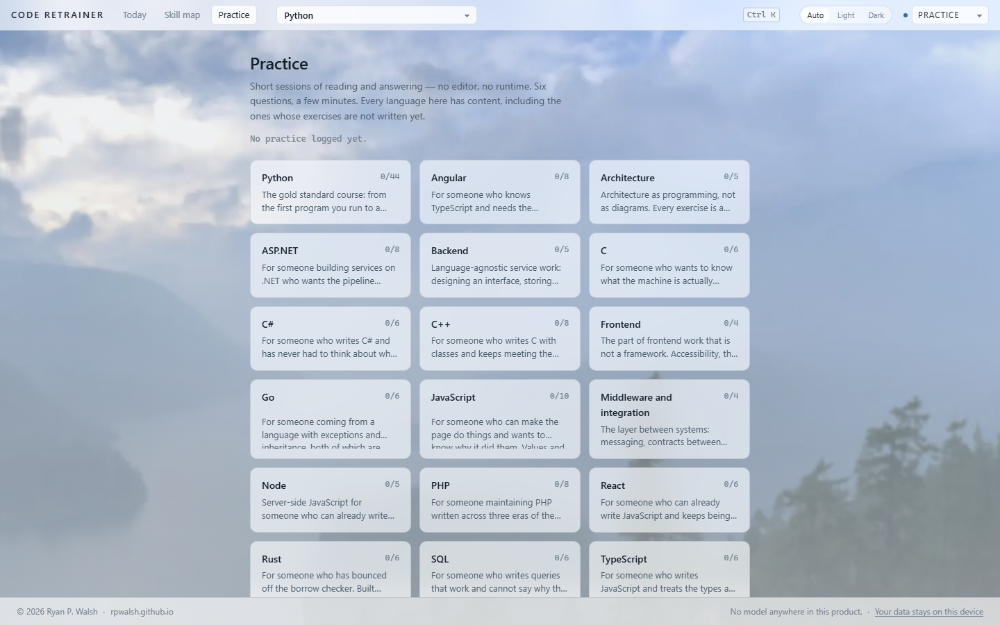
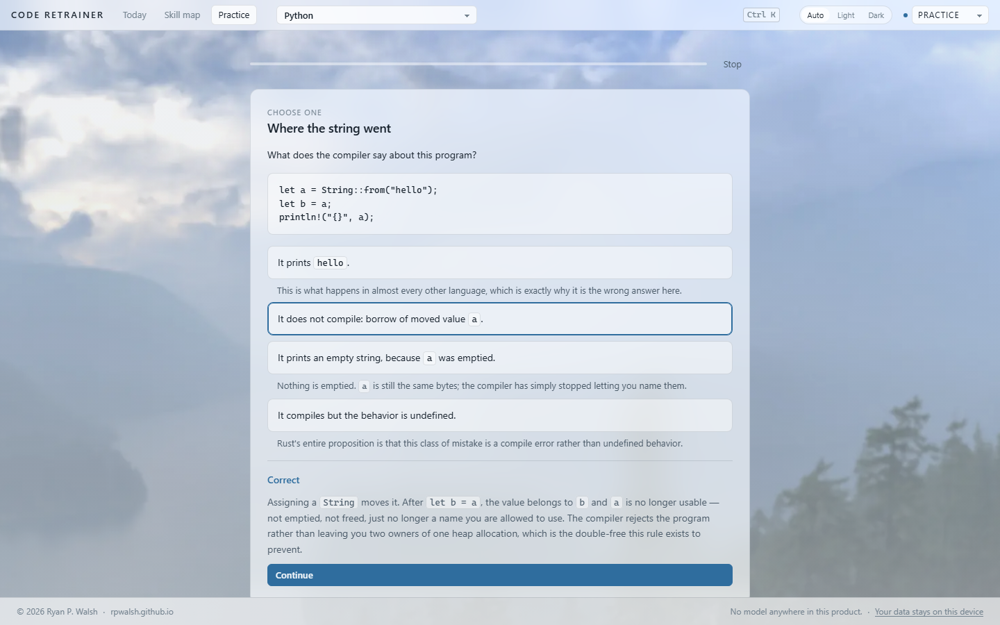

<!-- Copyright 2026 Ryan P. Walsh (rpwalsh.github.io) -->

# Code Retrainer

**Get your hands back.**

You could write this from memory once. Then came three years of accepting
suggestions, and somewhere in there the muscle went quiet. It is still in
there. This is the gym.

Deliberate practice for programmers: short daily sessions across fourteen
languages, and a real editor running real code judged by real tests. Not a
quiz, not a video course, and — the whole point — not an assistant that writes
it for you. **There is no model anywhere in this product.**


---

## What it is for

Most programming education asks _"do you understand this concept?"_.
Assessments ask _"can you solve this problem?"_. AI tools ask _"can the system
produce working code for you?"_.

This asks one question instead:

> **Can you independently produce working code in this language?**

You can understand dictionaries, loops and classes perfectly and still be
unable to write idiomatic Python without looking things up. That gap is a
skill of its own, it is measurable, and it is what this trains.

The gap is also new, and it is not a character flaw. Autocomplete is very good
now, and a skill you stop performing is a skill that fades — this is how
expertise has always worked, and it is why pilots keep flying hours they do not
strictly need. Finding out where you stand takes about ten minutes.

---

## Two ways to practice

**Activities** — read code and answer. Predict what it prints, find the fault,
put the lines in order, fill the gaps. Six questions, a few minutes, no editor
and no runtime — which is why they work for every subject here, including the
four that are disciplines rather than languages.



Every answer is graded by comparison against an answer written down by a human
author, and every one ends in an explanation of _why_ — including why each
wrong option was tempting.



**Exercises** — write the code yourself, against tests, with the starter
material progressively withdrawn. This is the part that measures fluency. Every
language has a runtime behind it, and every skill in every language has at
least one exercise behind it — `code-retrainer curriculum syllabus` reports
the coverage per language, and today every row reads 100%.

The two are not interchangeable and the software will not pretend they are.
Activities can move `knowledge`, `recognition`, `recall` and `debugging`. They
can **never** move `application`, `composition`, `transfer` or `independence` —
recognizing a right answer among four is not evidence you could produce it from
an empty editor. That ceiling is enforced by a test, not by a convention.

---

## What it is not

- **Not gamified.** There are no points, no combos, no hearts, no lives to run
  out of, and nothing to buy. A wrong answer costs nothing; the activity simply
  comes round again later in the same session, which is the spacing that
  actually works.
- **Not competitive.** No leaderboards, no leagues, no other learners. The only
  useful comparison is to yourself last month.
- **Not a clock.** Timers are opt-in, scaled to the exercise, and never appear
  on an activity. Plenty of the people this is for are between jobs and under
  quite enough pressure already.
- **Not punitive.** The practice log counts days practiced, and that number
  only ever goes up. Miss a week and you lose nothing you earned.
- **Not an account.** There is no sign-up, no email, no password. Nothing to
  create before you start, and nothing of yours leaves the machine.

---

## Where your work is kept

On your machine, and nowhere else.

In the browser it is **IndexedDB** — the database built into the browser
itself, which survives closing the tab, closing the browser and restarting the
computer. On the desktop it is a **SQLite file** in your user data directory.
Both hold the same thing: every attempt, the mastery model derived from it, the
review schedule and your preferences.

Not `localStorage`. That is a five-megabyte synchronous string bucket, and an
attempt carries its whole event log; it is also the first thing a "clear
cookies" sweep takes. One screen used to keep its practice count there and no
longer does — everything now goes through one store, which means everything
also travels with an export.

**It is yours to move or remove.** "Your data stays on this device" in the
footer opens one panel with three actions: save a copy to a file, load one back,
or delete everything. Deleting takes two deliberate steps, cannot be undone, and
really is total — the browser test for it erases, reloads, and checks that the
app has forgotten enough to ask which language you want all over again.

Two consequences worth stating plainly. **Private windows forget.** A browser
that refuses storage gets a banner saying so at the top of the app rather than
a silent surprise later. And because the data is local, **it is local to that
browser** — Firefox on your laptop and Chrome on your desktop are two separate
histories.

Moving between them is a file. Press <kbd>Ctrl K</kbd> and choose **Save my
progress to a file**; on the other machine, **Load progress from a file**. The
same file restores into the browser build or the desktop app, and it never
goes anywhere you do not send it.

---

## What using it is like

You get a prompt, an editor and a test suite. You write the code. The tests
tell you whether it works.


When something fails, the failure is a diagnosis rather than a wall of
traceback: what was expected, what arrived, and which skill the test was
probing.


Every failure also offers **Watch it run** — a recording of what your own code
actually did, line by line, with the values changing. That is the answer to
being stuck here. Not a longer explanation: a better instrument.

Hints exist. They are ordered from a gentle nudge to the answer outright, you
reveal them one at a time, and taking one is recorded. That is a cost, quietly
stated — not a punishment.

---

## What it measures

Not a percentage. Ten separate numbers, because they genuinely come apart:

|                  |                                         |
| ---------------- | --------------------------------------- |
| **Knowledge**    | Do you know what the machine will do?   |
| **Recognition**  | Do you recognize it when you see it?    |
| **Recall**       | Can you produce it from an empty file?  |
| **Application**  | Can you build something with it?        |
| **Composition**  | Can you combine several things at once? |
| **Debugging**    | Can you find the fault when it breaks?  |
| **Transfer**     | Can you use it somewhere new?           |
| **Speed**        | Can you do it at working pace?          |
| **Retention**    | Is it still there next week?            |
| **Independence** | Did you do it without help?             |

The one that matters most is the last one, and the chart that matters most is
**assistance dependency** — how often you still reach for a hint, the
documentation or the answer. It is drawn falling-is-good, and it is compared
against your own first sessions rather than against anybody else.


The skill map shows what rests on what. Select a skill and it tells you which
of the things beneath it is holding it back.

---

## The withdrawal ladder

Five modes, and they only ever take assistance away:

| Rung           | What it withdraws                              |
| -------------- | ---------------------------------------------- |
| **Learn**      | Nothing. Everything is available.              |
| **Practice**   | The solution.                                  |
| **Fluency**    | Hints, documentation, autocomplete.            |
| **Blank page** | The starter code. An empty file and the tests. |
| **Simulation** | The tests. You decide when it is right.        |

Full marks for recall require the blank page. Completing a skeleton is a
different act from producing the code, and a skeleton answers half the
question — which shape, which signature, which imports — before it is asked.

There is also **"I know this — skip it"**. Claiming a skill is neither refused
nor believed: you get one unseen exercise on the blank page, and passing it
credits the skill and everything under it. Failing costs nothing but the
shortcut.

---

## The curriculum

**Python: 228 lessons, twelve stages**, from the first program you run to a
working PageRank. Every one of them has exercises behind it.

| Stage                                 |                                                                                          |
| ------------------------------------- | ---------------------------------------------------------------------------------------- |
| First contact                         | Run, read, change. Expressions, names, branching.                                        |
| Loops and collections                 | The longest stage, because everything later is a loop over a collection.                 |
| Functions                             | Where most self-taught programmers plateau. Ends with recursion.                         |
| Writing it the way the language wants | Comprehensions, generators, sorting, translation from other languages.                   |
| Failure                               | Exceptions, validation, and bug hunts as their own discipline.                           |
| Modeling                             | Classes late, deliberately, so they are not used for everything.                         |
| The toolkit                           | Standard library, files, dates, tests, command lines.                                    |
| Recursion and cost                    | Complexity by counting operations, not by notation.                                      |
| Data structures                       | Stacks, linked lists, trees, heaps, graphs — built, then discarded for the library ones. |
| Algorithms                            | Search, sort, traversal, topological order, shortest paths.                              |
| Convergence                           | Floating point, iteration to a fixed point, and PageRank.                                |
| The interview canon                   | The dozen or so problem shapes technical interviews are assembled from.                  |

Every exercise has been executed against a real interpreter, and every test
suite has been checked by deliberately breaking the reference solution to
confirm the tests notice. A suite that passes a wrong answer is worse than no
suite, because it tells you that you were right.

**JavaScript: 64 lessons, four stages**, and about a fifth of them written so
far. Values and equality, data and who is holding it, closures and `this`, and
a whole stage on asynchrony — chosen from where this language costs people
time rather than translated from the Python course.

**Fourteen languages, each with a runtime that can execute an attempt and
judge it.** Python, JavaScript, TypeScript, Node, React, Angular, SQL, C, C++,
C#, ASP.NET, Go, Rust and PHP — 347 skills, 598 lessons, 147 machine-graded
exercises and 151 activities. Every one of the 347 skills has at least one
exercise behind it, and every exercise ships with a reference solution that
has been executed against its own tests.

Six of those run with nothing to install beyond what the toolkit already
needs. TypeScript, Node, React and Angular use the Node that runs the app
itself; SQL uses the SQLite inside Python's standard library; and Python is
Python. The other eight need their own toolchain — a C compiler, the Go
toolchain, rustc, the .NET SDK, the PHP CLI — and none of them guesses. Run:

```bash
npm run code-retrainer runtime doctor
```

and every language reports whether it can build and run a trivial program on
_this_ machine, with one sentence saying what to install if it cannot. It does
not check that a compiler is on PATH and call that ready; it compiles and runs
something, because "clang is installed" and "code can be executed here" are
different claims and only the second one matters.

**Four curricula have no runtime, and never will need one.** Frontend,
backend, middleware and architecture are disciplines practiced _in_ the
fourteen languages rather than beside them. They ship activities today, and
their exercises need fixtures rather than a compiler.

`code-retrainer curriculum planned` shows how far each one has got, and
`code-retrainer curriculum activities` checks every answer key in the product.

---

## What it will not do

- **No AI.** No generated hints, no completion, no chatbot, no model anywhere
  in the product. A test in this repository fails the build if an LLM client
  appears in the dependency tree, and a browser test asserts the running app
  makes no network request off its own origin at all — the Python interpreter
  is vendored with the site, so there is nothing to fetch.
- **No account.** No sign-in, no email, no identity. Your progress lives in
  your browser or on your disk; saving, loading and deleting it are all things
  you do yourself, from the footer. See [docs/data.md](docs/data.md).
- **No leaderboard, no ranking, no XP.** Nobody else is in this. Ranking
  changes the goal from _recover capability_ to _optimize a score_, and those
  come apart immediately. There is one habit number — days practiced — and it
  is a training log, not a score: it counts days, never minutes, cannot be
  raised by staying longer, and **never goes down**. A missed week costs you
  nothing you earned.
- **No cost, ever.** Nothing to buy, nothing to upgrade to. Python runs in
  your own browser, so serving one more learner costs nothing.

---

## Running it

There are two ways, from one codebase.

**In a browser.** It is a static site — no server executes your code, because
CPython runs in the page as WebAssembly. Any free static host will serve it.

**On the desktop.** An Electron app that uses your real Python interpreter,
which is faster and works with no network at all.

JavaScript currently runs on the desktop only — it uses the Node that the
toolkit already runs on. The browser version of that runtime is not built yet,
so the website is Python.

```bash
npm install
npm run web                       # build everything, bundle the curriculum
npx vite preview --root apps/web  # then open the address it prints
```

For the desktop app:

```bash
npm run web
npm run build --workspace @code-retrainer/desktop
cd apps/desktop && npx electron .
```

Node 22 or newer. The desktop runtime wants Python 3.10+ with pytest; the
browser version needs neither.

Before relying on the desktop runtime, check it:

```bash
node packages/cli/dist/main.js runtime doctor
```

That does not report version numbers. It runs code in a sandbox, trips a
timeout on purpose, and overflows an output buffer, so a pass means the
isolation actually works on your machine.

---

## Appearance

Light, dark, or following your system — which is the default, and is where it
will stay unless you change it.


Press <kbd>Ctrl</kbd>+<kbd>K</kbd> for everything: switching mode, changing
appearance, jumping between screens, showing a timer. The timer is off by
default, and its budget comes from the exercise's own difficulty rather than a
flat clock. Going over costs nothing and never reaches your score.

---

## Support, and the lack of it

Single maintainer. **No support, no contributions, no warranty.** Nothing here
is guaranteed to be correct, to keep working, or to keep existing. See
[CONTRIBUTING.md](CONTRIBUTING.md) before opening anything.

What _is_ guaranteed is the part that matters: it stays free for learners, it
runs offline, it never phones home, and there is no AI in it.

---

## License

Two licenses, protecting different things.

**The software** — everything under `packages/`, `apps/`, `languages/*/src`,
`languages/*/runtime`, `scripts/` and `tests/` — is under the
[PolyForm Noncommercial License 1.0.0](LICENSE.md). Personal use, research,
schools, universities, public research bodies and government are all covered.
Commercial use needs a separate written license.

**The curriculum** — the exercises, skills, prompts, hints and tests under
`languages/*/exercises` — is [licensed separately](CONTENT-LICENSE.md) and is
not open content. You may read all of it and learn from all of it, offline and
free and without asking anyone. Copying, modifying, translating or selling it
needs permission.

Nothing here restricts a learner. That is the point of the split, and the
reasoning is in [PRINCIPLES.md](PRINCIPLES.md) §10.

---

## For developers

[docs/architecture.md](docs/architecture.md) — how it is built and why.
[docs/development.md](docs/development.md) — building, testing, and the gates.
[docs/authoring.md](docs/authoring.md) — the exercise format.
[docs/deploying.md](docs/deploying.md) — putting it on a free host.
[docs/data.md](docs/data.md) — what is stored, where, the tests that keep it on
your machine, and how far those tests actually reach.
[PRINCIPLES.md](PRINCIPLES.md) — the constraints, each one enforced or
falsifiable.
