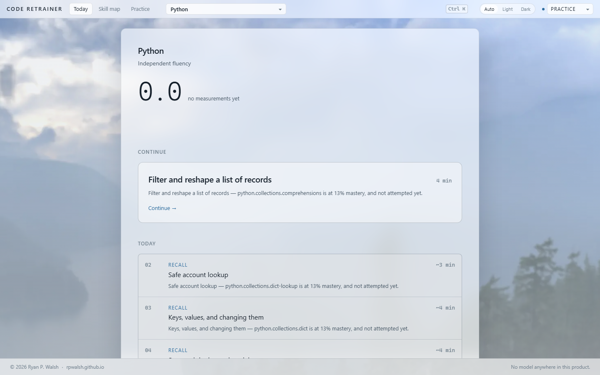
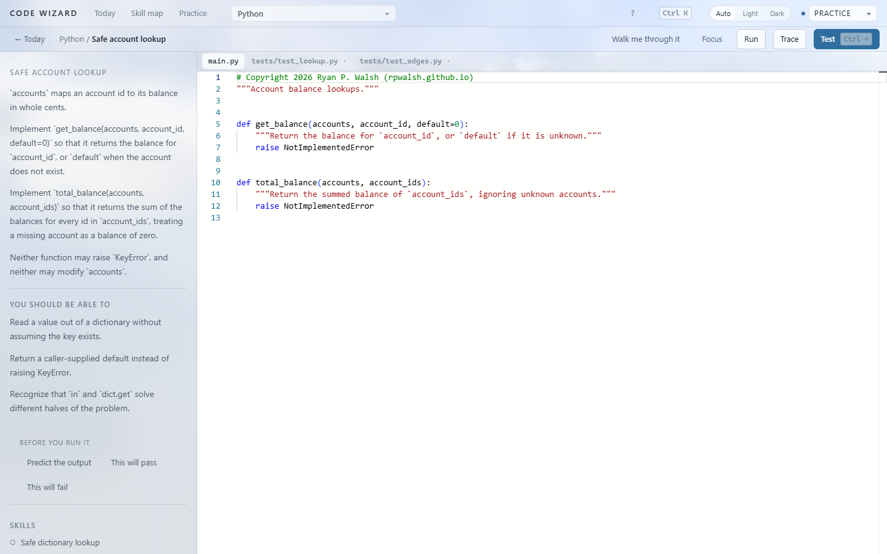
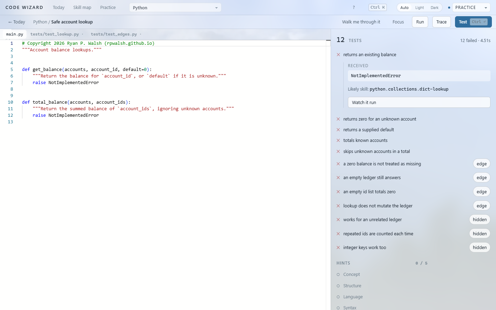
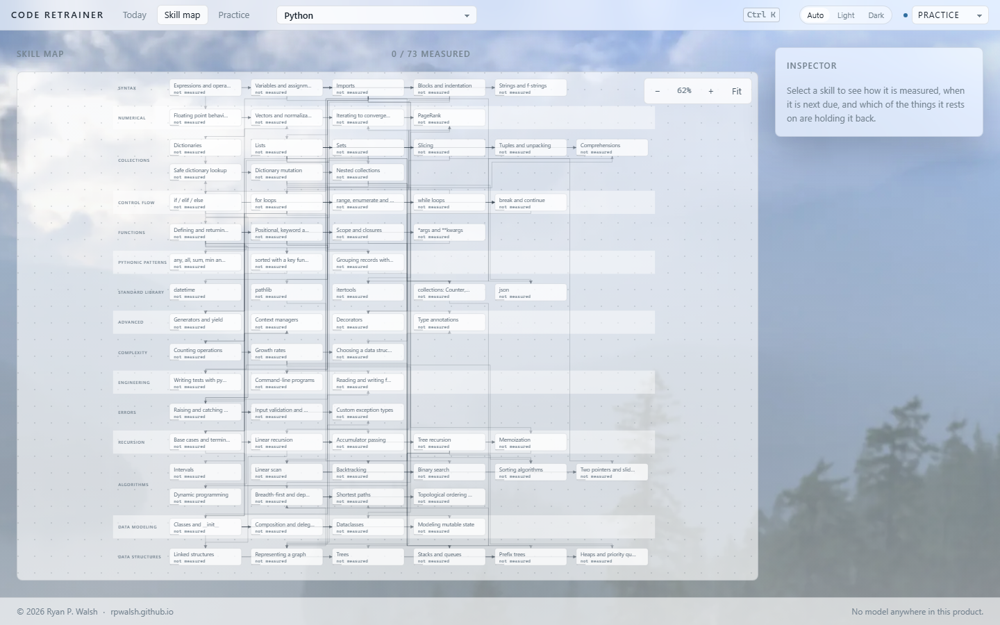
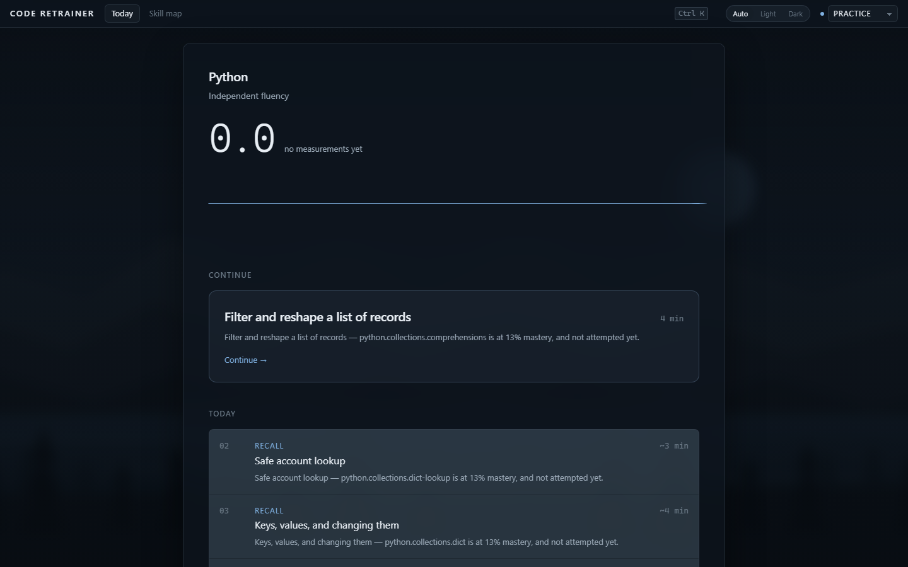

# Code Retrainer

**Get your hands back.**

A place to practise writing code yourself — in a real editor, running real
Python, judged by real tests. Not a quiz, not a video course, and not an
assistant that writes it for you.



---

## What it is for

Most programming education asks _"do you understand this concept?"_.
Assessments ask _"can you solve this problem?"_. AI tools ask _"can the system
produce working code for you?"_.

This asks one question instead:

> **Can you independently produce working code in this language?**

You can understand dictionaries, loops and classes perfectly and still be
unable to write idiomatic Python without looking things up. That gap is a
skill of its own, it is measurable, and it is what this trains.

If you learned this once and have spent the last few years accepting
suggestions, that gap is probably wider than you think. Finding out takes
about ten minutes.

---

## What using it is like

You get a prompt, an editor and a test suite. You write the code. The tests
tell you whether it works.



When something fails, the failure is a diagnosis rather than a wall of
traceback: what was expected, what arrived, and which skill the test was
probing.



Every failure also offers **Watch it run** — a recording of what your own code
actually did, line by line, with the values changing. That is the answer to
being stuck here. Not a longer explanation: a better instrument.

Hints exist. They are ordered from a gentle nudge to the answer outright, you
reveal them one at a time, and taking one is recorded. That is a cost, quietly
stated — not a punishment.

---

## What it measures

Not a percentage. Ten separate numbers, because they genuinely come apart:

|                  |                                         |
| ---------------- | --------------------------------------- |
| **Knowledge**    | Do you know what the machine will do?   |
| **Recognition**  | Do you recognise it when you see it?    |
| **Recall**       | Can you produce it from an empty file?  |
| **Application**  | Can you build something with it?        |
| **Composition**  | Can you combine several things at once? |
| **Debugging**    | Can you find the fault when it breaks?  |
| **Transfer**     | Can you use it somewhere new?           |
| **Speed**        | Can you do it at working pace?          |
| **Retention**    | Is it still there next week?            |
| **Independence** | Did you do it without help?             |

The one that matters most is the last one, and the chart that matters most is
**assistance dependency** — how often you still reach for a hint, the
documentation or the answer. It is drawn falling-is-good, and it is compared
against your own first sessions rather than against anybody else.



The skill map shows what rests on what. Select a skill and it tells you which
of the things beneath it is holding it back.

---

## The withdrawal ladder

Five modes, and they only ever take assistance away:

| Rung           | What it withdraws                              |
| -------------- | ---------------------------------------------- |
| **Learn**      | Nothing. Everything is available.              |
| **Practice**   | The solution.                                  |
| **Fluency**    | Hints, documentation, autocomplete.            |
| **Blank page** | The starter code. An empty file and the tests. |
| **Simulation** | The tests. You decide when it is right.        |

Full marks for recall require the blank page. Completing a skeleton is a
different act from producing the code, and a skeleton answers half the
question — which shape, which signature, which imports — before it is asked.

There is also **"I know this — skip it"**. Claiming a skill is neither refused
nor believed: you get one unseen exercise on the blank page, and passing it
credits the skill and everything under it. Failing costs nothing but the
shortcut.

---

## The curriculum

**228 lessons, twelve stages**, from the first program you run to a working
PageRank.

| Stage                                 |                                                                                          |
| ------------------------------------- | ---------------------------------------------------------------------------------------- |
| First contact                         | Run, read, change. Expressions, names, branching.                                        |
| Loops and collections                 | The longest stage, because everything later is a loop over a collection.                 |
| Functions                             | Where most self-taught programmers plateau. Ends with recursion.                         |
| Writing it the way the language wants | Comprehensions, generators, sorting, translation from other languages.                   |
| Failure                               | Exceptions, validation, and bug hunts as their own discipline.                           |
| Modelling                             | Classes late, deliberately, so they are not used for everything.                         |
| The toolkit                           | Standard library, files, dates, tests, command lines.                                    |
| Recursion and cost                    | Complexity by counting operations, not by notation.                                      |
| Data structures                       | Stacks, linked lists, trees, heaps, graphs — built, then discarded for the library ones. |
| Algorithms                            | Search, sort, traversal, topological order, shortest paths.                              |
| Convergence                           | Floating point, iteration to a fixed point, and PageRank.                                |
| The interview canon                   | The dozen or so problem shapes technical interviews are assembled from.                  |

Every exercise has been executed against a real interpreter, and every test
suite has been checked by deliberately breaking the reference solution to
confirm the tests notice. A suite that passes a wrong answer is worse than no
suite, because it tells you that you were right.

---

## What it will not do

- **No AI.** No generated hints, no completion, no chatbot, no model anywhere
  in the product. A test in this repository fails the build if an LLM client
  appears in the dependency tree, and a browser test asserts the running app
  makes no network request except for the Python runtime itself.
- **No account.** No sign-in, no email, no identity. Your progress lives in
  your browser or on your disk, and export and import are files.
- **No leaderboard, no streak, no XP.** Measurement is against your own past.
  Ranking changes the goal from _recover capability_ to _optimise a score_,
  and those come apart immediately.
- **No cost, ever.** Nothing to buy, nothing to upgrade to. Python runs in
  your own browser, so serving one more learner costs nothing.

---

## Running it

There are two ways, from one codebase.

**In a browser.** It is a static site — no server executes your code, because
CPython runs in the page as WebAssembly. Any free static host will serve it.

**On the desktop.** An Electron app that uses your real Python interpreter,
which is faster and works with no network at all.

```bash
npm install
npm run web                       # build everything, bundle the curriculum
npx vite preview --root apps/web  # then open the address it prints
```

For the desktop app:

```bash
npm run web
npm run build --workspace @code-retrainer/desktop
cd apps/desktop && npx electron .
```

Node 22 or newer. The desktop runtime wants Python 3.10+ with pytest; the
browser version needs neither.

Before relying on the desktop runtime, check it:

```bash
node packages/cli/dist/main.js runtime doctor
```

That does not report version numbers. It runs code in a sandbox, trips a
timeout on purpose, and overflows an output buffer, so a pass means the
isolation actually works on your machine.

---

## Appearance

Light, dark, or following your system — which is the default, and is where it
will stay unless you change it.



Press <kbd>Ctrl</kbd>+<kbd>K</kbd> for everything: switching mode, changing
appearance, jumping between screens, showing a timer. The timer is off by
default, and its budget comes from the exercise's own difficulty rather than a
flat clock. Going over costs nothing and never reaches your score.

---

## Support, and the lack of it

Single maintainer. **No support, no contributions, no warranty.** Nothing here
is guaranteed to be correct, to keep working, or to keep existing. See
[CONTRIBUTING.md](CONTRIBUTING.md) before opening anything.

What _is_ guaranteed is the part that matters: it stays free for learners, it
runs offline, it never phones home, and there is no AI in it.

---

## Licence

Two licences, protecting different things.

**The software** — everything under `packages/`, `apps/`, `languages/*/src`,
`languages/*/runtime`, `scripts/` and `tests/` — is under the
[PolyForm Noncommercial License 1.0.0](LICENSE.md). Personal use, research,
schools, universities, public research bodies and government are all covered.
Commercial use needs a separate written licence.

**The curriculum** — the exercises, skills, prompts, hints and tests under
`languages/*/exercises` — is [licensed separately](CONTENT-LICENSE.md) and is
not open content. You may read all of it and learn from all of it, offline and
free and without asking anyone. Copying, modifying, translating or selling it
needs permission.

Nothing here restricts a learner. That is the point of the split, and the
reasoning is in [PRINCIPLES.md](PRINCIPLES.md) §10.

---

## For developers

[docs/architecture.md](docs/architecture.md) — how it is built and why.
[docs/development.md](docs/development.md) — building, testing, and the gates.
[docs/authoring.md](docs/authoring.md) — the exercise format.
[docs/deploying.md](docs/deploying.md) — putting it on a free host.
[PRINCIPLES.md](PRINCIPLES.md) — the constraints, each one enforced or
falsifiable.
